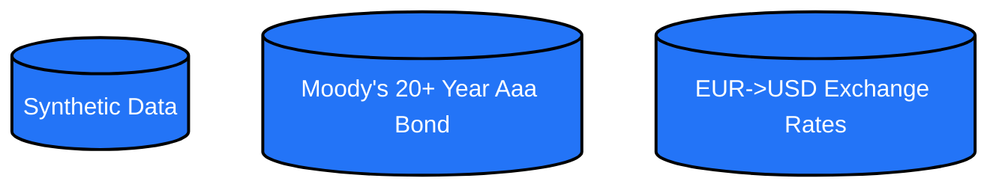

```mermaid
%%{init: {'theme':'forest'}}%%
graph TD

  %% Colors %%
  classDef blue fill:#2374f7,stroke:#000,stroke-width:2px,color:#fff
  classDef orange fill:#fc822b,stroke:#000,stroke-width:2px,color:#fff
  classDef green fill:#16b552,stroke:#000,stroke-width:2px,color:#fff
  classDef red fill:#ed2633,stroke:#000,stroke-width:2px,color:#fff
  classDef magenta fill:magenta,stroke:#000,stroke-width:2px,color:#fff

  A[(Synthetic Data)]:::blue
  B[(Moody's 20+ Year Aaa Bond)]:::blue
  C[(EUR->USD Exchange Rates)]:::blue
```
